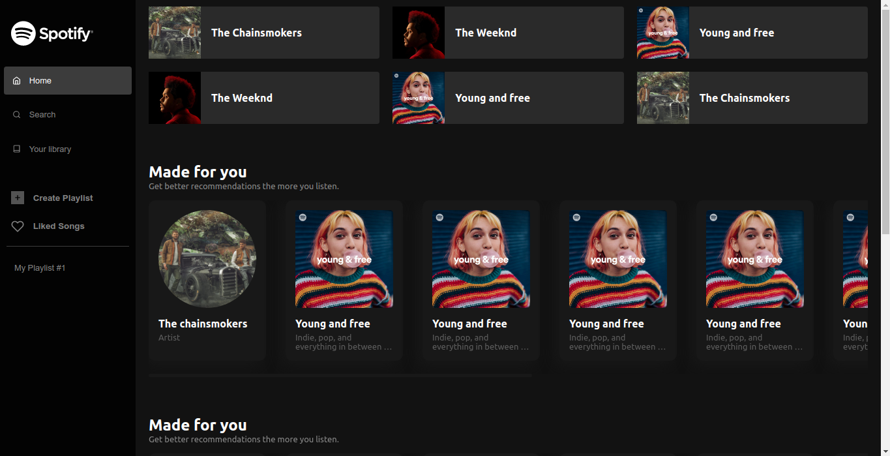

# Spotify Clone
This project is made to learn more about React with NextJS and styled-components

## Getting Started

To run this project locally you need to start the development server

```bash
npm run dev
# or
yarn dev
```

Or you can see the deployed version [here](https://spotifyclone.rafaelfarias.tech)

